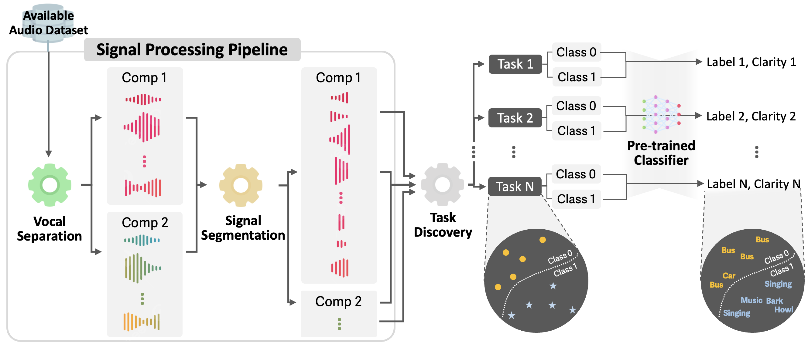

# Audio Class Discovery
Developing new machine learning applications often requires the collection of new datasets. However, existing datasets may already contain relevant information to train models for new purposes. Our proposed framework discovers **new classes** within audio datasets by incorporating (1) an **audio pre-processing pipeline** to decompose different sounds in audio samples, and (2) an automated **model-based annotation mechanism** to identify the discovered classes. These newly discovered classes can then be used for training new downstream applications. Please refer to [our paper](https://arxiv.org/abs/2410.23008) for more details.

<p align="center">
    
</p>

---

The detailed steps of downloading the data and running the framework are summarized as follows.

## 1. The Dataset
This framework is specifically designed for finding new classes in audio datasets. Our framework does not rely on any supervision and hence the dataset can be unlabeled as well. In summary, any audio dataset, labeled or unlabeled, of a reasonable dataset size can be used with this framework for finding new classes.

In this paper, we have used some of the well-known benchmark datasets like [AudioSet](https://research.google.com/audioset/) and [FSD50K](https://zenodo.org/records/4060432). Please refer to the original dataset pages for the setup, license descriptions and citations.

## 2. Running the Signal Processing Pipeline
**Note: This is the data preprocessing for Audioset dataset. For other datasets make applicable changes accordingly.**

### 2.1 Dataset Preparation
i. You need to prepare for ontology.csv from the ontology.json file present in the [AudioSet Github](https://github.com/audioset/ontology).
The csv file’s columns should consist of id, name, and child_ids.

ii. Download Audioset dataset data you want to test. You would obtain a meta csv file for the data classes you downloaded.

iii. Place the audio data under a directory named as the corresponding class name.

### 2.2 Vocal Separation
i. Set the audio directory path in the `preprocessing/vocal_separation.py`.

ii. Run the `vocal_separation.py` with an argument of space-separated class names to read audio files in each class directory.

iii. It will divide each sample into two components: one with **enhanced vocal components (Comp#1)** and the other containing **background audio signatures (Comp#2)**.

### 2.3 Segmentation
i. Set the audio directory path in `preprocessing/separation.py`

ii. Run the separation.py with an argument of space-separated class names to read audio files after the vocal separation in each class directory.

## 3. Performing Class Discovery
One of our proposed framework's key components is finding the hidden classes within the pre-processed audio files. One interesting way to do this is by assessing the hidden class boundaries within the dataset. For this, in this version of the proposed framework, we use the [Task Discovery Framework](https://taskdiscovery.epfl.ch). To use this approach and discover the class boundaries, clone the repo from [here](https://github.com/EPFL-VILAB/TaskDiscovery) and follow the citation and license requirements accordingly.

However, as the vanilla task discovery framework is designed for image datasets, we have made the necessary changes to the original framework and adapted it for audio datasets. Please replace the repo with files from the [task-discovery folder](https://github.com/dr-bell/audio-class-discovery/tree/main/task-discovery) to accommodate the changes made considering AudioSet as the intended dataset.

Please change these files accordingly to add new datasets (other than the AudioSet). We have provided in-line comments as a reference.

Finally, to run the task discovery framework the following command needs to be executed.
```
python3 train-as-uniformity.py --dataset <dataset> --feat_type _vs_changepoint --name <project_name> --h_dim 32 --n_linear_tasks 32 --uniformity_coef 25 --task_temp 5 --check_val_every_n_epoch 5 --shuffle --arch resnet18 --as_arch resnet18 --dataset_path <dataset_path> --as_eval_max_epochs 50 --as_test_max_epochs 50 --num_data 10000 --vs <component_type>
```

Here the `dataset` and `dataset_path` refer to the name of the dataset and the path to the dataset directory, respectively. The argument of `vs` refers to the component we want to use (`fore` for **Comp#1** and `back` for **Comp#2**). The argument `name` can be replaced by any suitable project name. 

The hyperparameters used here are not exactly for reproducing the results. For more details about the settings, experiments and hyperparamters please refer to [our original paper](https://arxiv.org/abs/2410.23008).
## 4. Automatically Annotating the New Classes

To be uploaded soon.

---
## Citations

If this work, its findings or settings are helpful in your research, please consider citing our paper:

```
@misc{choi2024soundcollageautomateddiscoverynew,
      title={SoundCollage: Automated Discovery of New Classes in Audio Datasets}, 
      author={Ryuhaerang Choi and Soumyajit Chatterjee and Dimitris Spathis and Sung-Ju Lee and Fahim Kawsar and Mohammad Malekzadeh},
      year={2024},
      eprint={2410.23008},
      archivePrefix={arXiv},
      primaryClass={cs.SD},
      url={https://arxiv.org/abs/2410.23008}, 
}
```

